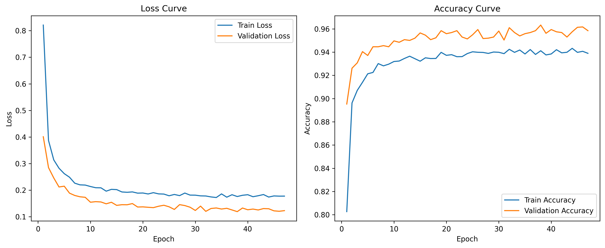
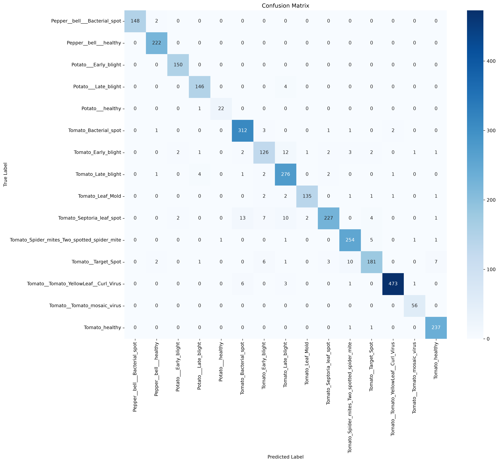
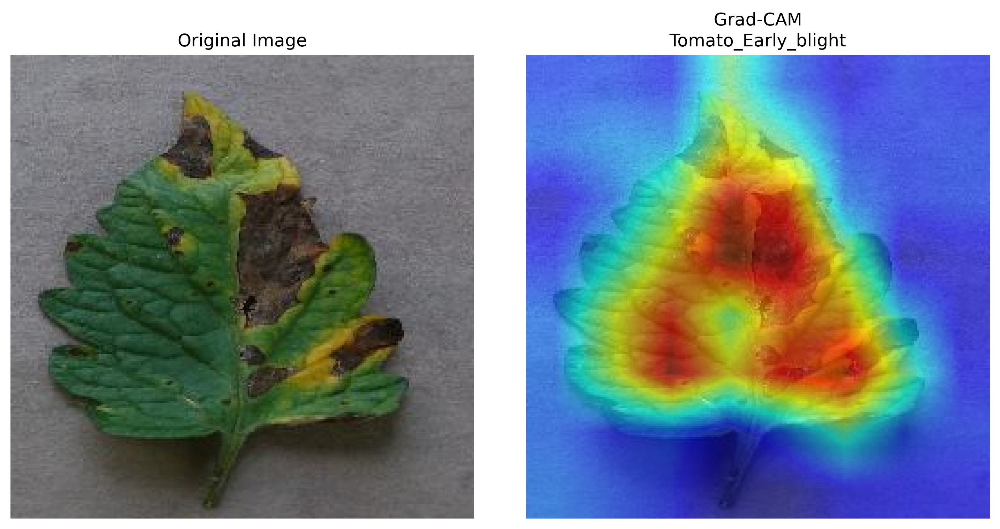

# 🌱 Plant Disease Classification using EfficientNet-B0

A deep learning computer vision project for plant disease classification using **PyTorch** and **EfficientNet-B0 Transfer Learning**.

The project implements an end-to-end pipeline including:

- Dataset preparation
- Data augmentation
- Transfer learning
- Model training
- Evaluation
- Single image prediction
- Grad-CAM explainability


---

# 📌 Overview

Plant diseases can significantly affect crop production. Early detection from leaf images can help identify diseases faster.

This project uses a pretrained **EfficientNet-B0** model to classify plant leaf images into **15 disease categories**.

The model uses transfer learning:

- EfficientNet-B0 pretrained on ImageNet
- Custom classification head
- Feature extraction training strategy


---

# 🧠 Model

**Architecture:** EfficientNet-B0

**Framework:** PyTorch

**Training approach:** Transfer Learning / Feature Extraction


Pipeline:

```

Input Image
|
|
EfficientNet-B0 Backbone
|
|
Classifier Layer
|
|
Disease Prediction

```


---

# ✨ Features

✅ EfficientNet-B0 pretrained model  
✅ Plant disease classification  
✅ Train / Validation / Test split  
✅ Data augmentation  
✅ Early stopping  
✅ Training visualization  
✅ Classification report  
✅ Confusion matrix  
✅ Single image prediction  
✅ Grad-CAM visualization  


---

# 📂 Dataset

Dataset:

**PlantVillage Dataset**

The dataset contains healthy and diseased plant leaf images.

Classes:

- Pepper diseases
- Potato diseases
- Tomato diseases

Total:

```

15 classes

```

Dataset structure:

```

data/

├── train/
├── val/
└── test/

```

The dataset is not included because of its size.


---

# 🏗️ Project Structure

```

plant-disease-classification/

├── README.md
├── requirements.txt
├── Run.ipynb

├── data/
│   └── README.md

├── models/
│   └── efficientnet_b0_plant_disease.pth

├── results/
│   ├── training_curves.png
│   ├── confusion_matrix.png
│   ├── classification_report.txt
│   └── gradcam_Tomato_Early_blight.png

└── src/
├── train.py
├── evaluation.py
├── predict.py
├── gradcam.py
├── visualization.py
├── data_setup.py
├── engine.py
└── utils.py

````


---

# ⚙️ Installation

Clone repository:

```bash
git clone https://github.com/Maani87/plant-disease-classification.git
````

Move into the project:

```bash
cd plant-disease-classification
```

Install dependencies:

```bash
pip install -r requirements.txt
```

---

# ✂️ Dataset Preparation

After downloading the PlantVillage dataset, split it into:

```
train/
val/
test/
```

The project uses the split dataset for training and evaluation.

---

# 🏋️ Training

Train the model:

```bash
python src/train.py
```

Example:

```bash
python src/train.py \
--batch_size 32 \
--lr 0.001 \
--num_epochs 100
```

The best model is saved:

```
models/

└── efficientnet_b0_plant_disease.pth
```

---

# 📈 Results

The final model achieved:

| Metric            |  Score |
| ----------------- | -----: |
| Test Accuracy     | 95.41% |
| Macro F1-score    |   0.95 |
| Weighted F1-score |   0.95 |

Best validation performance:

```
Epoch: 38

Validation Accuracy: 96%
Validation Loss: 0.1192
```

---

# 📊 Training Curves

Training progress is visualized using loss and accuracy curves.



---

# 🔥 Confusion Matrix

Performance across all 15 disease classes:



---

# 🔍 Prediction

Predict a new image:

```bash
python src/predict.py --image path/to/image.jpg
```

Example:

```
===== Prediction =====

Class:
Tomato_Early_blight

Confidence:
99.95%
```

---

# 👁️ Grad-CAM Explainability

Grad-CAM shows which regions of the image influenced the model prediction.

Run:

```bash
python src/gradcam.py
```

Example:



---

# 📓 Run Notebook

`Run.ipynb` contains the complete execution workflow:

* Training
* Evaluation
* Prediction
* Grad-CAM generation

---

# 🛠️ Technologies Used

* Python
* PyTorch
* Torchvision
* Scikit-learn
* Matplotlib
* Seaborn
* Grad-CAM

---

# 🚀 Future Improvements

* Fine-tuning EfficientNet layers
* Learning rate scheduling
* Hyperparameter optimization
* Comparing other architectures:

  * ResNet50
  * ConvNeXt
  * EfficientNet variants
* FastAPI deployment
* Docker deployment

---

# 👨‍💻 Author

Mani

GitHub:

[https://github.com/Maani87](https://github.com/Maani87)

---

# 📄 License

MIT License
